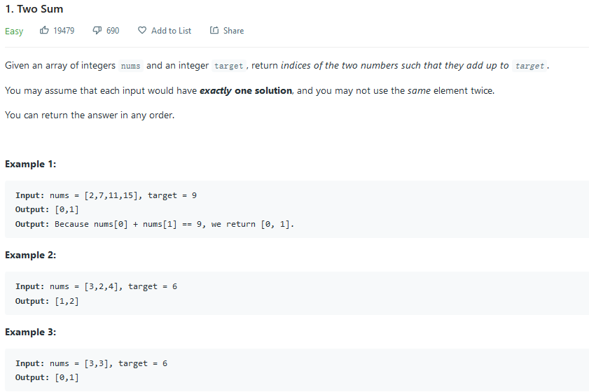
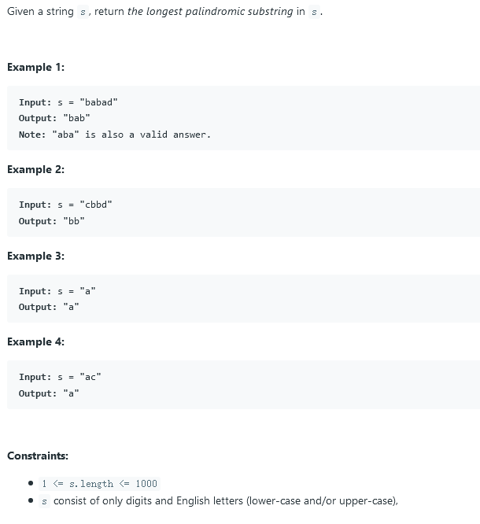

## 1. Two Sum



### solution 1:

时间复杂度为 `nlogn`

将`nums`排序后利用两个指针从左右两端开始遍历选取

```c++
vector<int> twoSum(vector<int>& nums, int target) {
	vector<int> ans;
	vector<int> temp;
	temp = nums;
	int n = temp.size();
	std::sort(temp.begin(), temp.end());
	int i = 0, j = n - 1;
	while (i < j) 
	{
		if (temp[i] + temp[j] > target)j--;
		else if (temp[i] + temp[j] < target)i++;
		else break;
	}
	if (i < j) 
	{
		for (int k = 0; k < n; k++) 
		{
			if (i < n && nums[k] == temp[i])
			{
				ans.push_back(k);
				i = n;
			}
			else if (j < n && nums[k] == temp[j]) 
			{
				ans.push_back(k);
				j = n;
			}
			if (i == n && j == n)return ans;
		}
	}
	return ans;
}
```

### solution 2: unordered map

时间复杂度为`O(n)`

利用一个`unordered map`来存储带配对的数据，对`nums`中的每一个新数据进行查找，若`map`中有可配对对象，则配对；否则将该新数据录入`map`待配对。

```c++
 vector<int> twoSum(vector<int> &numbers, int target)
{
    //Key is the number and value is its index in the vector.
	unordered_map<int, int> hash;
	vector<int> result;
	for (int i = 0; i < numbers.size(); i++) {
		int numberToFind = target - numbers[i];

            //if numberToFind is found in map, return them
		if (hash.find(numberToFind) != hash.end()) {
                    //+1 because indices are NOT zero based
			result.push_back(hash[numberToFind]);
			result.push_back(i);			
			return result;
		}

            //number was not found. Put it in the map.
		hash[numbers[i]] = i;
	}
	return result;
}
```

#### 知识点：各种map的操作复杂度

##### map, set, multimap, and multiset

上述四种容器采用红黑树实现，红黑树是平衡二叉树的一种。不同操作的时间复杂度近似为:

插入: `O(logN)`

查看:`O(logN)`

删除:`O(logN)`

##### hash_map, hash_set, hash_multimap, and hash_multiset

上述四种容器采用哈希表实现，不同操作的时间复杂度为：

插入:O(1)，最坏情况O(N)。

查看:O(1)，最坏情况O(N)。

删除:O(1)，最坏情况O(N)。
记住，如果你采用合适的哈希函数，你可能永远不会看到最坏情况。但是记住这一点是有必要的

原文链接：https://blog.csdn.net/wusecaiyun/article/details/46723363

## 2. Add Two Numbers


### solution 1:

时间复杂度`O(n)`

简单思路，直接逐个指针相加即可。

```c++
ListNode* addTwoNumbers(ListNode* l1, ListNode* l2) {
          ListNode* head=new ListNode(-1);//存放结果的链表
        ListNode* h=head;//移动指针
        int sum=0;//每个位的加和结果
        bool carry=false;//进位标志
        while(l1!=NULL||l2!=NULL)
        {
            sum=0;
            if(l1!=NULL)
            {
                sum+=l1->val;
                l1=l1->next;
            }
            if(l2!=NULL)
            {
                sum+=l2->val;
                l2=l2->next;
            }
            if(carry)
                sum++;
            h->next=new ListNode(sum%10);
            h=h->next;
            carry=sum>=10?true:false;
        }
        if(carry)
        {
            h->next=new ListNode(1);
        }
        return head->next;

    }
```

## 3. Longest Substring Without Repeating Characters


### solution 1:

时间复杂度`O(n)`

建立一个滑动窗口，窗口内为无重复字符串。对每一个新字符，加入窗口`end`端，检查是否有重复，若有，则将出现重复位置+1处置为新`start`

```c++
int lengthOfLongestSubstring(string s) {
    //s[start,end) 前面包含 后面不包含
        int start(0), end(0), length(0), result(0);
        int sSize = int(s.size());
        while (end < sSize)
        {
            char tmpChar = s[end];
            for (int index = start; index < end; index++)
            {
                if (tmpChar == s[index])
                {
                    start = index + 1;
                    length = end - start;
                    break;
                }
            }

            end++;
            length++;
            result = max(result, length);
        }
        return result;
    }
```

## 4. Median of Two Sorted Arrays


### solution 1:

时间复杂度为`O(m+n)`

最简单的思路为逐个向前遍历，直至遍历至中间位置即可。

### solution 2:

时间复杂度为`O(logmin(m,n))`

关键在于划分数组`nums1`和`nums2`，使得划分后左边元素个数和右边元素个数相等。


划分采用二分法划分，使得时间复杂度降为对数级别。

```c++
double findMedianSortedArrays(vector<int>& nums1, vector<int>& nums2) {
   if (nums1.size() > nums2.size()) {
		return findMedianSortedArrays(nums2, nums1);
	}

	int size1 = nums1.size(), size2 = nums2.size();
	int left = 0, right = size1;
	//划分左半需要的元素个数
	int total_left = (size1 + size2 + 1) / 2;

	while (left < right)
	{
		//nums1的分割线
		int i = (left + right + 1) / 2;
		//nums2的分割线
		int j = total_left - i;
		int nums1_left_max = i == 0 ? INT_MIN : nums1[i - 1];
		int nums2_right_min = j == size2 ? INT_MAX : nums2[j];
		/*
		 *如此设计既不会越界，也不会陷入死循环
		 *左边界永远将上一个成立分割线包含在内
		 *而下一次寻找不会重复寻找上一次找到的边界
		*/
		if (nums1_left_max <= nums2_right_min) {
			left = i;
		}
		else {
			right = i - 1;
		}
	}

	int i = (left + right + 1) / 2, j = total_left - i;
	//若越界，则赋值为最大最小值
	int nums1_left_max = i == 0 ? INT_MIN : nums1[i - 1];
	int nums2_left_max = j == 0 ? INT_MIN : nums2[j - 1];
	int nums1_right_min = i == size1 ? INT_MAX : nums1[i];
	int nums2_right_min = j == size2 ? INT_MAX : nums2[j];

	if ((size1 + size2) % 2) {
		return max(nums1_left_max, nums2_left_max);
	}
	else {
		return (max(nums1_left_max, nums2_left_max) + min(nums1_right_min, nums2_right_min)) / 2.0;
	}
}
```

## 5. Longest Palindromic Substring



### solution 1:

DP solution

时间复杂度`O(n^2)`，空间复杂度`O(n^2)`


### solution 2:

expanding from center

时间复杂度`O(n^2)`，空间复杂度`O(1)`

### solution 3:Manacher's Algorithm

https://www.cnblogs.com/bitzhuwei/p/Longest-Palindromic-Substring-Part-II.html

## 6. ZigZag Conversion


### solution 1:

时间复杂度`O(n)`

将每一行的字符串构造出来，最后再合并即可。

```c++
string convert(string s, int numRows) {
         if (numRows == 1) return s;

        vector<string> rows(min(numRows, int(s.size())));
        int curRow = 0;
        bool goingDown = false;

        for (char c : s) {
            rows[curRow] += c;
            if (curRow == 0 || curRow == numRows - 1) goingDown = !goingDown;
            curRow += goingDown ? 1 : -1;
        }

        string ret;
        for (string row : rows) ret += row;
        return ret;

    }
```

## 7. Reverse Integer


### solution 1:

时间复杂度`O(n)`

简单的求逆过程，但注意溢出判断。

```c++
int reverse(int x) {
      int rev = 0;
        while (x != 0) {
            int pop = x % 10;
            x /= 10;
            if (rev > INT_MAX/10 || (rev == INT_MAX / 10 && pop > 7)) return 0;
            if (rev < INT_MIN/10 || (rev == INT_MIN / 10 && pop < -8)) return 0;
            rev = rev * 10 + pop;
        }
        return rev;
    }
```

## 8. String to Integer (atoi)


### solution 1:

时间复杂度`O(n)`

逐个读入判断即可，需注意越界判断。

```c++
int myAtoi(string str) {
    string::size_type i = 0;
	//跳过所有空白和非数字
	while (str[i] == ' ') {
		i++;
		if (i == str.size()) {
			return 0;
		}
	}
	//符号记录，默认无符号为正
	bool sign = false;
	if (str[i] == '-') {
		i++;
		sign = true;
	}
	else if (str[i] == '+') {
		i++;
	}
	else if (str[i] < '0' && str[i]>'9') {
		return 0;
	}
	int result = 0, temp = i;
	while (str[i] >= '0' && str[i] <= '9' && i < str.size())
	{
		int pop = str[i++] - 48;
		if (result > INT_MAX / 10 || (result == INT_MAX / 10 && pop > 7)) return INT_MAX;
		if (result < INT_MIN / 10 || (result == INT_MIN / 10 && pop > 8)) return INT_MIN;
		if (sign) {
			result = result * 10 - pop;
		}
		else {
			result = result * 10 + pop;
		}
	}
	return result;
}
```

## 9. Palindrome Number


### solution 1:

时间复杂度`O(n)`

倒置一半，比较另一半即可，还可以避免溢出风险。

```c++
bool isPalindrome(int x) {
        if (x < 0) {
        return false;
    }
        if (x == 0) return true;
    int digit = (int) (log10(x) + 1); //总位数
    int revert = 0;
    int pop = 0;
    //倒置右半部分 
    for (int i = 0; i < digit / 2; i++) { 
        pop = x % 10;
        revert = revert * 10 + pop;
        x /= 10;
    }
    if (digit % 2 == 0 && x == revert) {
        return true;
    }
    //奇数情况 x 除以 10 去除 1 位
    if (digit % 2 != 0 && x / 10 == revert) { 
        return true;
    }
    return false;
}
```

## 10. Regular Expression Matching


### solution 1:

时间复杂度`O(TP)`

动态规划方法即可。

reference: https://www.youtube.com/watch?v=l3hda49XcDE&list=PLrmLmBdmIlpuE5GEMDXWf0PWbBD9Ga1lO

```c++
bool isMatch(string s, string p) {
    if(!p.empty()&&p[0]=='*'){
        return false;
    }
    int m = s.size(), n = p.size();
	//result[i][j]: if s[0..i - 1] matches p[0..j - 1]
	vector<vector<bool>> result(m + 1, vector<bool>(n + 1, false));
	result[0][0] = true;
	//直接从2处开始，因为第一个不可能是*，一定不匹配
	for (int i = 2; i <= n; i++) {
		result[0][i] = p[i - 1] == '*' && result[0][i - 2];
	}

	for (int i = 1; i <= m; i++) {
		for (int j = 1; j <= n; j++)
		{
			if (p[j - 1] != '*') {
				result[i][j] = result[i - 1][j - 1] && (s[i - 1] == p[j - 1] || p[j - 1] == '.');
			}
			else {
				result[i][j] = result[i][j - 2] || (s[i - 1] == p[j - 2] || p[j - 2] == '.') && result[i - 1][j];
			}
		}
	}
	return result[m][n];
}
```

