## 11. Container With Most Water

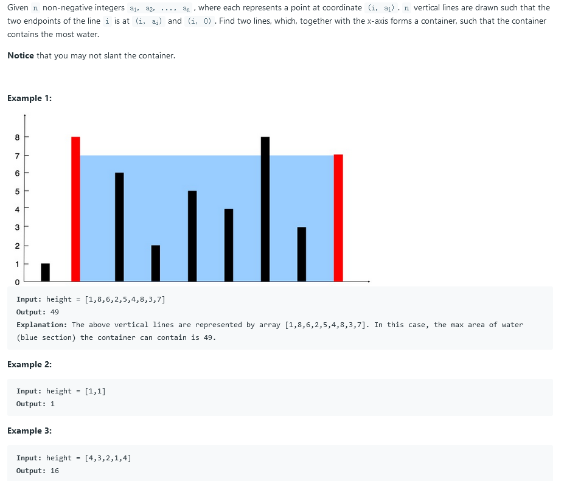

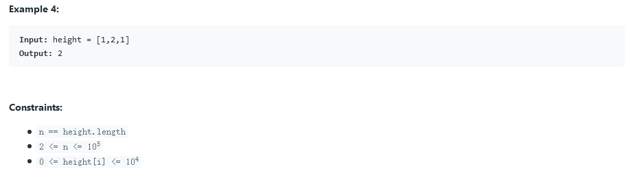

### solution 1:

时间复杂度`O(n)`

本题由于只需要求出一个最大的容器即可，便相对来讲较为简单。可从两端开始搜索，找最大容量的容器。

注意，每一次只缩减高度相对较小的一边，以便能够找到较大的。

```c++
int maxArea(vector<int>& height) {
	int m = INT32_MIN;
	for (int i = 0, j = height.size() - 1; i < j;) {
		m = max(m, (j - i) * min(height[i], height[j]));
		height[i] < height[j] ? i++ : j--;
	}
	return m;
}
```

## 12. Integer to Roman

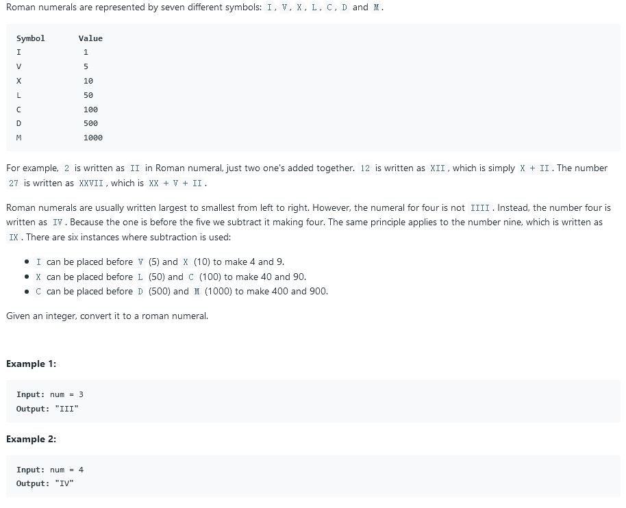

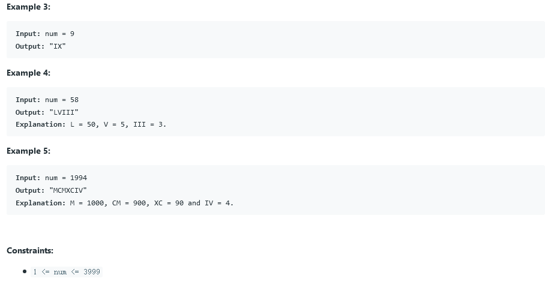

### solution 1:

时间复杂度`O(n)`

能够较为直观的想到以给定`symbol`为分隔逐个取余来计算，但要处理诸如`900`和`400`之类的特殊数据，利用一个标志`comp`来额外处理。

```c++
string intToRoman(int num) {
	string result;
	static const int seg[9] = { 1000,500,100,50,10,5,1,0,0 };
	static const char roman[7] = { 'M','D','C','L','X','V','I' };
	for (int i = 0, comp = 2; num; i++) {
		int temp = num / seg[i];
		num %= seg[i];
		while (temp > 0) {
			result.push_back(roman[i]);
			temp--;
		}
		temp = num / (seg[i] - seg[comp]);
		num %= (seg[i] - seg[comp]);
		if (temp == 1) {
			result.push_back(roman[comp]);
			result.push_back(roman[i]);
		}
		if (comp - i == 1) comp += 2;
	}
	return result;
}
```

### solution 2:

时间复杂度`O(n)`

为`solution 1`的改进，增加了分隔单位而不再需要利用`comp`来处理`900`之类的数。

```c++
string intToRoman(int num) 
    {
        string res;
        string sym[] = {"M", "CM", "D", "CD", "C", "XC", "L", "XL", "X", "IX", "V", "IV", "I"};
        int val[] = {1000, 900, 500, 400, 100, 90, 50, 40, 10, 9, 5, 4, 1};
        
        for(int i=0; num != 0; i++)
        {
            while(num >= val[i])
            {
                num -= val[i];
                res += sym[i];
            }
        }
        
        return res;
    }
```

## 13. Roman to Integer

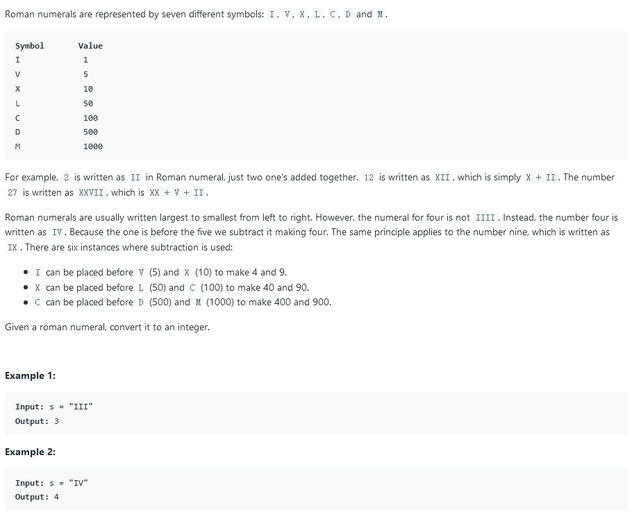

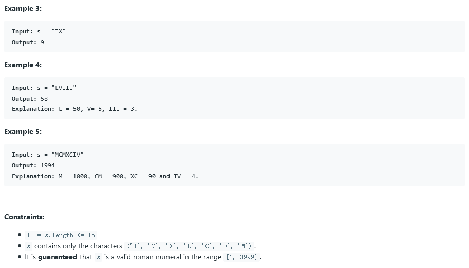

### solution 1:

时间复杂度`O(n)`

同上题的`solution 1`，需要额外处理`IV`之类的情况，利用`current`和`previous`来记录当前字母和上一个字母。如果当前字母比上一个字母单位小，说明正常录入，直接加上当前字母对应数字；如果当前字母比上一个字母单位大，说明出现了类似`IV`的情况，则`result += (seg[current] - 2 * seg[privous]);`

```c++
int romanToInt(string s) {
	static const int seg[9] = { 1000,500,100,50,10,5,1,0,0 };
	static const char roman[7] = { 'M','D','C','L','X','V','I' };
	int result = 0;
	int current = 0, privous = 0;
	for (string::iterator begin = s.begin(); begin != s.end(); begin++) {
		for (current = 0; *begin != roman[current]; current++);
		if (current >= privous) result += seg[current];
		else {
			result += (seg[current] - 2 * seg[privous]);
		}
		privous = current;
	}
	return result;
}
```

### solution 2:

时间复杂度`O(n)`

同`solution 1`，但进行相应改进，使得不再需要`current`和`previous`来进行记录。

从后往前遍历，这样若出现`IV`，则`res += (res >= 5 ? -1 : 1);`会在读到`I`时进行调整。

```c++
int romanToInt(string s) {
		int res = 0;
		for (int i = s.length() - 1; i >= 0; i--) {
			switch (s[i]) {
			case 'M':
					res += 1000; break;
			case 'D':
					res += 500; break;
			case 'C':
					res += 100 * (res >= 500 ? -1 : 1); break;
			case 'L':
					res += 50; break;
			case 'X':
					res += 10 * (res >= 50 ? -1 : 1); break;
			case 'V':
					res += 5; break;
			case 'I':
					res += (res >= 5 ? -1 : 1); break;
			default:
					break;
			}
		}
		return res;
}
```

## 14. Longest Common Prefix

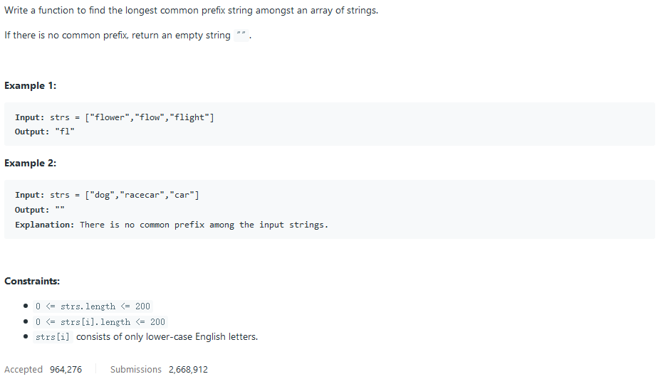

### solution 1:

时间复杂度为`O(n)`

思路常规，逐个向后搜索即可。

```c++
string longestCommonPrefix(vector<string>& strs) {
    string prefix = "";
	if (strs.empty()) return prefix;
	for (int i = 0; i < strs[0].size(); i++) {
		char ch = strs[0][i];
		for (int j = 1; j < strs.size(); j++) {
			if (ch != strs[j][i]) return prefix;
		}
		prefix.push_back(ch);
	}
	return prefix;
}
```

## 15. 3Sum

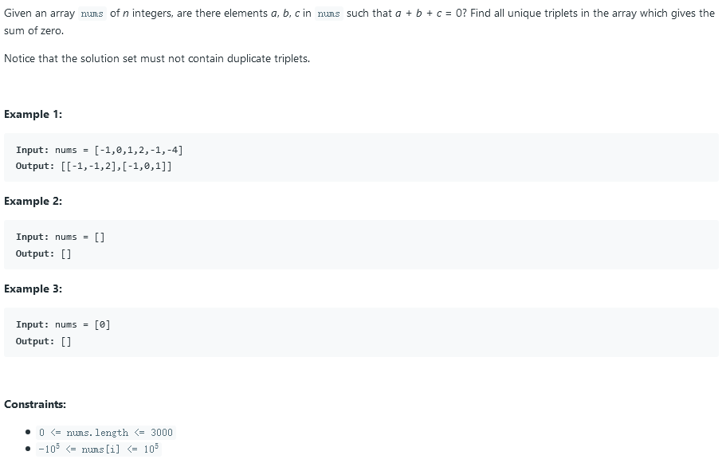

### solution 1:

时间复杂度`nlogn`

此题类似于`2sum`题目，但由于是三个，所以选定第一个再找另两个，这样就不再适合使用`map`来降低复杂度到`O(n)`

```c++
vector<vector<int>> threeSum(vector<int>& nums) {
    vector<vector<int> > res;

	std::sort(nums.begin(), nums.end());

	for (int i = 0; i < nums.size(); i++) {

		int target = -nums[i];
		int front = i + 1;
		int back = nums.size() - 1;

		if (target < 0)
		{
			break;
		}

		while (front < back) {

			int sum = nums[front] + nums[back];

			// Finding answer which start from number num[i]
			if (sum < target)
				front++;

			else if (sum > target)
				back--;

			else {
				vector<int> triplet(3, 0);
				triplet[0] = nums[i];
				triplet[1] = nums[front];
				triplet[2] = nums[back];
				res.push_back(triplet);

				// Processing duplicates of Number 2
				// Rolling the front pointer to the next different number forwards
				while (front < back && nums[front] == triplet[1]) front++;

				// Processing duplicates of Number 3
				// Rolling the back pointer to the next different number backwards
				while (front < back && nums[back] == triplet[2]) back--;
			}

		}

		// Processing duplicates of Number 1
		while (i + 1 < nums.size() && nums[i + 1] == nums[i])
			i++;

	}

	return res;
    }
```

## 16. 3Sum Closest

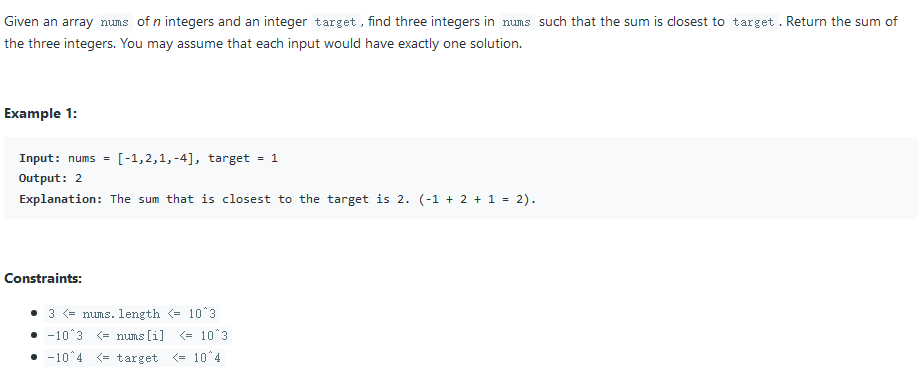

### solution 1:

时间复杂度`nlogn`

类似于`3Sum`，只是需要增加一个`diff`动态簿记量来寻找最小差值。

```c++
int threeSumClosest(vector<int>& nums, int target) {
    std::sort(nums.begin(), nums.end());
	int diff = INT_MAX, sum = 0;
	for (int i = 0; i < nums.size(); i++) {
		int record = nums[i];
		int res = target - record;
		int front = i + 1;
		int back = nums.size() - 1;
		while (front < back) {
			int first = nums[front], second = nums[back];
			int temp = first + second;
			if (temp < res) {
				if (res - temp < diff) {
					diff = res - temp;
					sum = record + temp;
				}
				while (front < back && nums[front] == first) front++;
			}
			else if (temp > res) {
				if (temp - res < diff) {
					diff = temp - res;
					sum = record + temp;
				}
				while (front < back && nums[back] == second) back--;
			}
			else return target;
		}
		while (i + 1 < nums.size() && nums[i + 1] == nums[i])
			i++;
	}
	return sum;
    }
```

## 17. Letter Combinations of a Phone Number

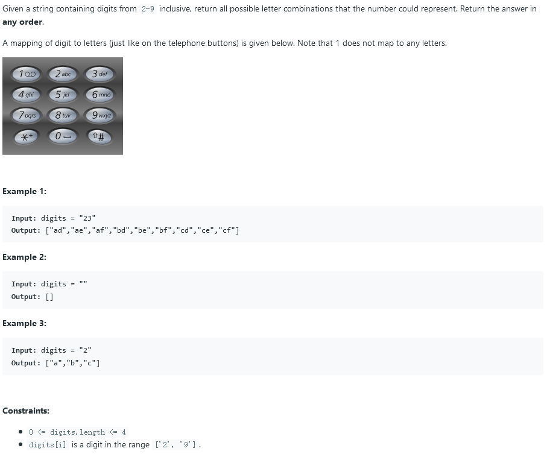

### solution 1:

使用递归来构造

```c++
void get_str(vector<string>& result, string& digits, string former, int i = 0) {
	static const char decode[8][5] = { "abc","def","ghi","jkl","mno","pqrs","tuv","wxyz" };
	if (i != digits.size()) {
		for (int j = 0, k = digits[i] - '2'; decode[k][j] != '\0'; j++) {
			get_str(result, digits, former + decode[k][j], i + 1);
		}
	}
	else {
		result.push_back(former);
	}
}
vector<string> letterCombinations(string digits) {
    vector<string> result;
	get_str(result, digits, "");
	if (result.size() == 1) result.clear();
	return result;
}
```

### solution 2:

使用迭代算法，空间复杂度大幅降低。

#### 知识点 vector 中 swap 的使用

```c++
const vector<string> pad = {
        "", "", "abc", "def", "ghi", "jkl",
        "mno", "pqrs", "tuv", "wxyz"
    };
    
    vector<string> letterCombinations(string digits) {
        if (digits.empty()) return {};
		vector<string> result;
        result.push_back("");
        
        for(auto digit: digits) {
            vector<string> tmp;
            for(auto candidate: pad[digit - '0']) {
                for(auto s: result) {
                    tmp.push_back(s + candidate);
                }
            }
            result.swap(tmp);
        }
        return result;
    }
```

## 18. 4Sum

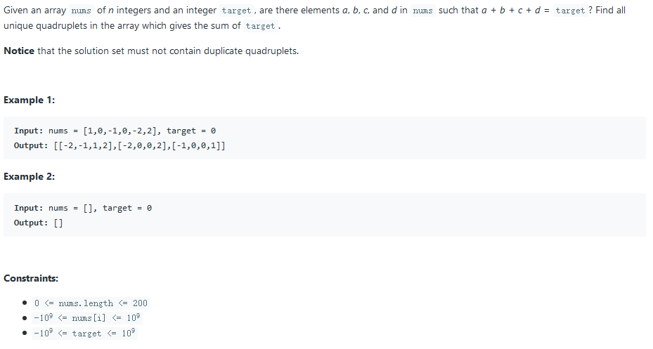

### solution 1:

类似于`3Sum`

```c++
vector<vector<int>> fourSum(vector<int>& nums, int target) {
        vector<vector<int> > res;

	std::sort(nums.begin(), nums.end());

	for (int i = 0; i + 1 < nums.size(); i++) {
		for (int j = i + 1; j < nums.size(); j++) {
			int less = target - nums[i] - nums[j];
			int front = j + 1;
			int back = nums.size() - 1;
			while (front < back) {

				int sum = nums[front] + nums[back];

				// Finding answer which start from number num[i]
				if (sum < less)
					front++;

				else if (sum > less)
					back--;

				else {
					vector<int> quad(4, 0);
					quad[0] = nums[i];
					quad[1] = nums[j];
					quad[2] = nums[front];
					quad[3] = nums[back];
					res.push_back(quad);

					// Processing duplicates of Number 2
					// Rolling the front pointer to the next different number forwards
					while (front < back && nums[front] == quad[2]) front++;

					// Processing duplicates of Number 3
					// Rolling the back pointer to the next different number backwards
					while (front < back && nums[back] == quad[3]) back--;
				}

			}

			// Processing duplicates of Number 1
			while (j + 1 < nums.size() && nums[j + 1] == nums[j])
				j++;
		}
		while (i + 1 < nums.size() && nums[i + 1] == nums[i])
			i++;

	}

	return res;
}
```

## 19. Remove Nth Node From End of List

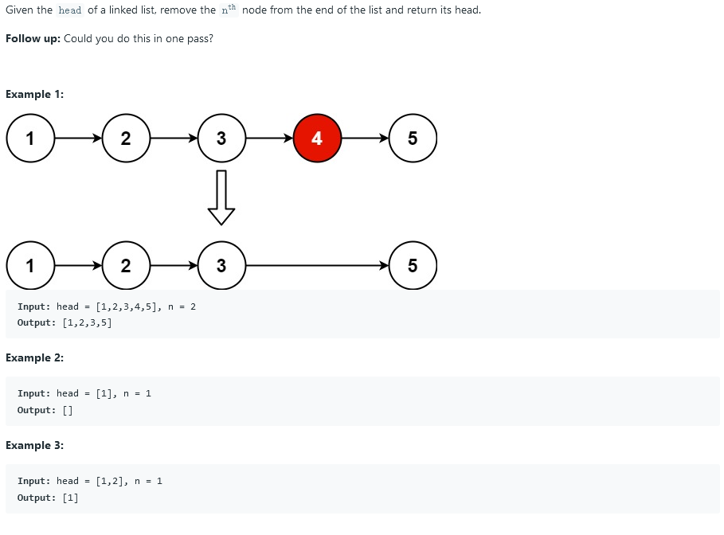

### solution 1:

时间复杂度`O(n)`

此题的关键在于在一次遍历中删除目标，避免第二次的重复遍历。

我们可以使用一个`current`指针和一个`tail`指针，两个指针之间间隔`n`个节点，当`tail`指向末尾时，`current`便指向应删除节点。

```c++
ListNode* removeNthFromEnd(ListNode* head, int n) {
	ListNode* tail = head, * current = head, * former = head;
	for (int i = n; i > 0; i--) {
		tail = tail->next;
	}
	while (tail != nullptr) {
		former = current;
		current = current->next;
		tail = tail->next;
	}
	if (head == current) {
		head = current->next;
	}
	else {
		former->next = current->next;
		delete current;
	}
	return head;
}
```

## 20. Valid Parentheses

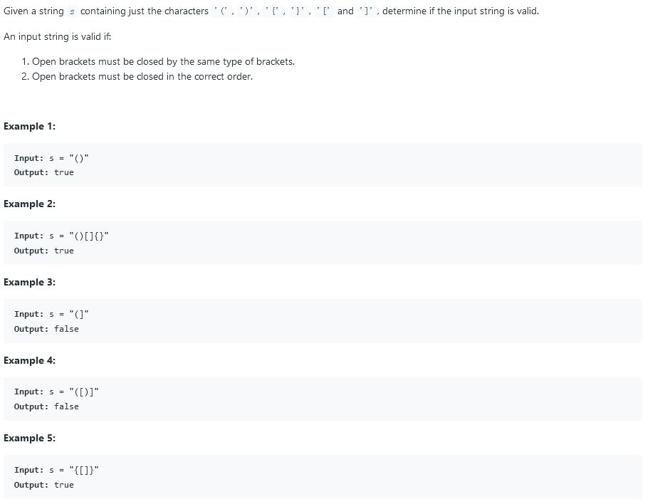

### solution 1:

时间复杂度`O(n)`

使用一个栈来进行相关匹配操作。

```c++
bool isComp(char left, char right) {
	return left == '(' && right == ')' || left == '[' && right == ']' || left == '{' && right == '}';
}

bool isValid(string s) {
	stack<char> record;
	for (int i = 0; i < s.size(); i++) {
		if (s[i] == '[' || s[i] == '{' || s[i] == '(') record.push(s[i]);
		else {
			if (record.empty() || !isComp(record.top(), s[i])) return false;
			record.pop();
		}
	}
	return record.empty();
}
```

### solution 2:

我们甚至可以不用借助栈来操作，而将空间复杂度降为`O(1)`

利用`indexOfLastOpen`指针来模拟栈顶指针工作，借用`string`之前已经遍历过了空间来作为栈。

```c++
bool isValid(string s) {
	int indexOfLastOpen = -1;
	for (int i = 0; i < s.length(); ++i)
	{
		switch (s[i])
		{
		case '(':
		{
			indexOfLastOpen++;
			s[indexOfLastOpen] = '(';
			break;
		}
		case '{':
		{
			indexOfLastOpen++;
			s[indexOfLastOpen] = '{';
			break;
		}
		case '[':
		{
			indexOfLastOpen++;
			s[indexOfLastOpen] = '[';
			break;
		}
		case ')':
		{
			if (indexOfLastOpen >= 0)
			{
				if (s[indexOfLastOpen] != '(')
				{
					return false;
				}
			}
			else
			{
				return false;
			}
			indexOfLastOpen--;
			break;
		}
		case '}':
		{
			if (indexOfLastOpen >= 0)
			{
				if (s[indexOfLastOpen] != '{')
				{
					return false;
				}
			}
			else
			{
				return false;
			}
			indexOfLastOpen--;
			break;
		}
		case ']':
		{
			if (indexOfLastOpen >= 0)
			{
				if (s[indexOfLastOpen] != '[')
				{
					return false;
				}
			}
			else
			{
				return false;
			}
			indexOfLastOpen--;
			break;
		}
		}
	}

	return indexOfLastOpen >= 0 ? false : true;
}

/*Instead of pushing the left parenthesis in the stack, this can be optimized to push the right parenthesis only and hence a cleaner code.
The time and space complexity is the same though.*/
```

