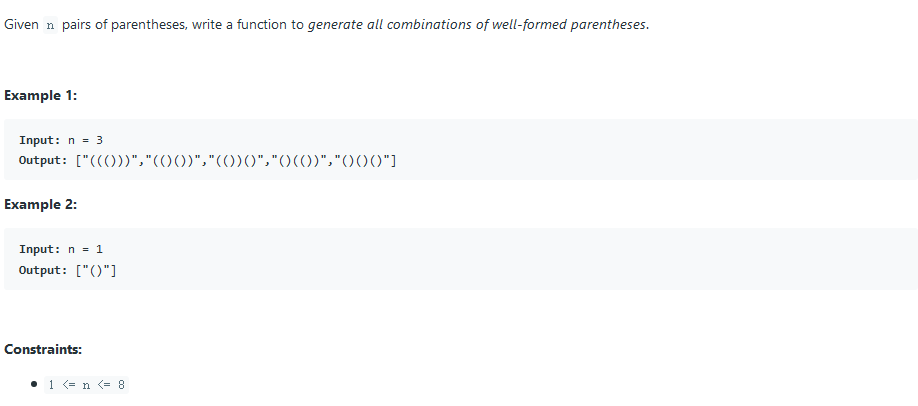

## 21. Merge Two Sorted Lists


### solution 1:

链表的常规操作，注意头指针的灵活运用即可。

```c++
ListNode* mergeTwoLists(ListNode* l1, ListNode* l2) {
	ListNode* head = new ListNode(INT_MIN);
	ListNode* current = head;
	while (l1 != nullptr && l2 != nullptr) {
		if (l1->val > l2->val) {
			current->next = l2;
			l2 = l2->next;
		}
		else {
			current->next = l1;
			l1 = l1->next;
		}
		current = current->next;
	}
	if (l1 == nullptr) current->next = l2;
	else if (l2 == nullptr) current->next = l1;
	head = head->next;
	return head;
}
```

## 22. Generate Parentheses



### solution 1:

深度优先搜素，保证'('多于')'即可

```c++
void generate(vector<string>& result, string temp, int left, int right, int n) {
	if (right == n) {
		result.push_back(temp);
		return;
	}
	if (left < n) generate(result, temp + '(', left + 1, right, n);
	if (right < left) generate(result, temp + ')', left, right + 1, n);
}

vector<string> generateParenthesis(int n) {
	vector<string> result;
	generate(result, "", 0, 0, n);
	return result;
}
```

### solution 2:

我们注意到，`generate`中的`string temp`其实可以用引用替代，并且可在一开始便声明一个`2*n`大小的`string`来避免内存的重新分配与释放。

```c++
vector<string> generateParenthesis(int n) {
        vector<string> ans;
        string temp(2 * n, ' ');
        help(ans, n, n, temp, 0);
        return ans;
    }
    void help(vector<string>& vec, int left, int right, string& curr, int idx) {
        if (left < 0 || left > right) return;
        if (left == 0 && right == 0)
            vec.push_back(curr);
        if(left > 0) {
            curr[idx] = '(';
            help(vec, left - 1, right, curr, idx + 1);
        }
        if (right > left) {
            curr[idx] = ')';
            help(vec, left, right - 1, curr, idx + 1);
        }
    }
```

## 23. Merge k Sorted Lists


### solution 1:

此题类似于`Merge Two Sorted Lists (num 21)`，只需要处理好`list`中各个链表即可。

```c++
ListNode* mergeKLists(vector<ListNode*>& lists) {
	if (lists.empty()) return NULL;
	ListNode* head = new ListNode(INT_MIN);
	ListNode* current = head;	
	while (lists.size() > 1) {
		vector<ListNode*>::iterator temp;
		int min = INT_MAX;
		for (vector<ListNode*>::iterator i = lists.begin(); i != lists.end();) {
			if (*i != NULL) {
				if ((*i)->val < min) {
					min = (*i)->val;
					temp = i;
				}
				i++;
			}
			else {
				i = lists.erase(i);
			}
		}
		if (min != INT_MAX) {
			current->next = *temp;
			current = current->next;
			*temp = (*temp)->next;
		}	
	}
	current->next = lists[0];
	head = head->next;
	return head;
}
```

## 24. Swap Nodes in Pairs


### solution 1:

链表的基本操作。

```c++
ListNode* swapPairs(ListNode* head) {
    if (head == NULL) return NULL;
    ListNode* current = head, * current_nxt = head->next;
    ListNode* pri = new ListNode(INT_MIN, head);
    head = pri;
    while (current_nxt != NULL) {
        pri->next = current_nxt;
        pri = current;
        current->next = current_nxt->next;
        current_nxt->next = current;
        current = current->next;
        current_nxt = current ? current->next : NULL;
    }
    return head->next; 
    }
```

## 25. Reverse Nodes in k-Group


### solution 1:

不同于24题那样直接倒置，这里介绍一种新方法。


```c++
ListNode* reverseKGroup(ListNode* head, int k) {
    if (head == NULL || k == 1)
        return head;
    ListNode* preheader = new ListNode(-1);
    preheader->next = head;
    ListNode* curr = preheader, * next = NULL, * prev = preheader;
    int num = 0;
    while (curr = curr->next)
        num++;
    while (num >= k) {
        curr = prev->next;
        next = curr->next;
        for (int i = 1; i < k; i++) {
            curr->next = next->next;
            next->next = prev->next;
            prev->next = next;
            next = curr->next;
        }
        prev = curr;
        num -= k;
    }
    return preheader->next;
}
```

## 26. Remove Duplicates from Sorted Array


### solution 1:

此题核心在于利用前面已遍历的部分作为可利用空间，而不需要将元素逐个前移。

```c++
int removeDuplicates(vector<int>& nums) {
	if (nums.empty()) return 0;
	int i = 0, j = 1;
	while (j < nums.size()) {
		if (nums[i] == nums[j]) {
			j++;
		}
		else {
			nums[++i] = nums[j++];
		}
	}
	return i + 1;
}
```

## 27. Remove Element


### solution 1:

核心思想类似于题目26。

```c++
int removeElement(vector<int>& nums, int val) {
	if (nums.empty()) return 0;
	int i = 0, j = 0;
	while (j < nums.size()) {
		if (nums[j] == val) {
			j++;
		}
		else {
			nums[i++] = nums[j++];
		}
	}
	return i;
}
```

## 28. Implement strStr()


### solution 1: KMP

时间复杂度：`O(n)`

```c++
void KMP_next(vector<int>& next, const string& needle) {
	for (int i = 0, j = next[0] = -1; i < needle.size() - 1;) {
		for (; j > -1 && needle[i] != needle[j];) {
			j = next[j];
		}
		i++; j++;
		if (needle[i] == needle[j])
			next[i] = next[j];
		else
			next[i] = j;
	}
}

int strStr(string haystack, string needle) {
	if (needle.empty()) return 0;
	vector<int> next(needle.size());
	KMP_next(next, needle);
	for (int i = 0, j = 0; j < haystack.size();) {
		for (; i > -1 && needle[i] != haystack[j];)
			i = next[i];
		i++; j++;
		if (i >= needle.size()) return j - i;
	}
	return -1;
}
```

## 29. Divide Two Integers


### solution 1:

使用位移操作，将`dividend`分为`dividend = divisor * (2^k+2^q ... ... 2^n)`模式，则`res = (2^k+2^q ... ... 2^n)`

在负数上操作以避免溢出(转换到正数上操作会将-2^31^转换为2^31^溢出。

```c++
int divide(int dividend, int divisor) {
	if (dividend == INT_MIN && divisor == -1) return INT_MAX;
	bool sign = dividend > 0 == divisor > 0;
	dividend = dividend > 0 ? -dividend : dividend;	
	divisor = divisor > 0 ? -divisor : divisor;
	int result = 0;
	while (dividend <= divisor) {
		int temp = 1, cur_sum = divisor << 1, prev_sum = divisor;
		while (dividend <= cur_sum && cur_sum < prev_sum) {
			prev_sum = cur_sum;
			cur_sum <<= 1;
			temp <<= 1;
		}
		result += temp;
		dividend -= prev_sum;
	}
	return sign ? result : -result;
}
```

## 30. Substring with Concatenation of All Words


### solution 1: rough hash match

用字符串的hash值来进行粗匹配，粗匹配成功后再用map的方法进行精细匹配

```c++
typedef map<string, int> map_type;

map_type words_map;
int word_lenth;

void GetMap(const vector<string>& words) {
	pair<map_type::iterator, bool> insert;
	word_lenth = words[0].size();
	for (int i = 0; i < words.size(); i++) {
		insert = words_map.insert(map_type::value_type(words[i], 0));
		insert.first->second++;
	}
}

bool judge(string::iterator begin, string::iterator end) {
	pair<map_type::iterator, bool> insert;
	map_type current_map;
	while (begin != end) {
		insert = current_map.insert(map_type::value_type (string(begin, begin + word_lenth), 0));
		insert.first->second++;
		begin += word_lenth;
		map_type::iterator it = words_map.find(insert.first->first);
		if (it == words_map.end() || insert.first->second > it->second) return false;
	}
	return true;
}

vector<int> findSubstring(string s, vector<string>& words) {
	int lenth = 0, hash = 0;
	GetMap(words);
	vector<int> result;
	for (int i = 0; i < words.size(); i++) {
		lenth += words[i].size();
		for (int j = 0; j < words[i].size(); j++) hash += words[i][j] - 'a';
	}
	if (s.size() < lenth) return result;
	int current = 0;
	for (int i = 0; i < lenth; i++) {
		current += s[i] - 'a';
	}
	if (current == hash && judge(s.begin(), s.begin() + lenth)) {
		result.push_back(0);
	}
	for (int i = 0, j = lenth; j < s.size(); i++, j++) {
		current += ((s[j] - 'a') - (s[i] - 'a'));
		if (current == hash && judge(s.begin() + i + 1, s.begin() + i + 1 + lenth)) {
			result.push_back(i + 1);
		}
	}
	return result;
}
```

### solution 2: hash match

时间复杂度`O(n)`

精心设计hash函数，使得hash冲突几乎不可能发生。

```c++
double hash(double f, double code[], string &word) {
        double result = 0.;
        for (auto &c : word) result = result * f + code[c];
        return result;
    }
    vector<int> findSubstring(string S, vector<string> &L) {
        uniform_real_distribution<double> unif(0., 1.);
        default_random_engine seed;
        double code[128];
        for (auto &d : code) d = unif(seed);
        double f = unif(seed) / 5. + 0.8;
        double value = 0;

        // The complexity of the following for loop is O(L.size( ) * nW).
        for (auto &str : L) value += log(hash(f, code, str));

        int unit = 1e9;
        int key = (value-floor(value))*unit;
        int nS = S.size(), nL = L.size(), nW = L[0].size();
        double fn = pow(f, nW-1.);
        vector<int> result;
        if (nS < nW) return result;
        vector<double> values(nS-nW+1);
        string word(S.begin(), S.begin()+nW);
        values[0] = hash(f, code, word);

        // Use a moving window to hash every word with length nW in S to a float number, 
        // which is stored in vector values[]
        // The complexity of this step is O(nS).
        for (int i=1; i<=nS-nW; ++i) values[i] = (values[i-1] - code[S[i-1]]*fn)*f + code[S[i+nW-1]];

        // This for loop will run nW times, each iteration has a complexity O(nS/nW)
        // So the overall complexity is O(nW * (nS / nW)) = O(nS)
        for (int i=0; i<nW; ++i) {
            int j0=i, j1=i, k=0;
            double sum = 0.;

            // Use a moving window to hash every L.size() continuous words with length nW in S.
            // This while loop will terminate within nS/nW iterations since the increasement of j1 is nW,
            // So the complexity of this while loop is O(nS / nW).
            while(j1<=nS-nW) {
                sum += log(values[j1]);
                ++k;
                j1 += nW;
                if (k==nL) {
                    int key1 = (sum-floor(sum)) * unit;
                    if (key1==key) result.push_back(j0);
                    sum -= log(values[j0]);
                    --k;
                    j0 += nW;
                }
            }
        }
        return result;
    }
```

