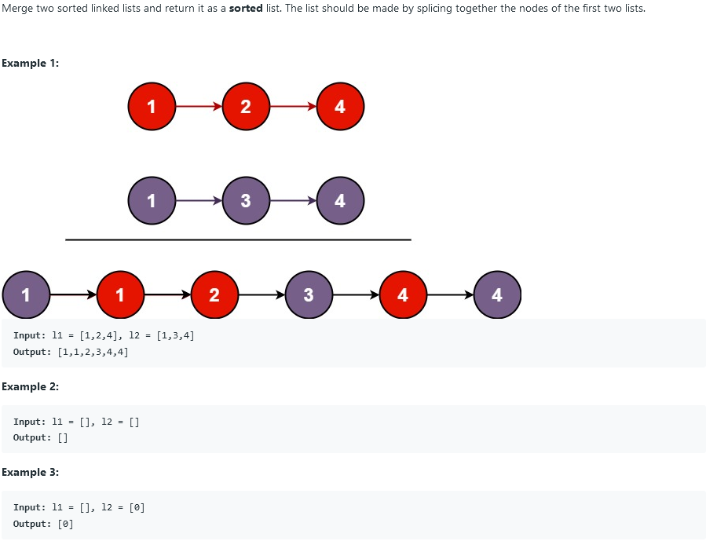

## 21. Merge Two Sorted Lists




### solution 1:

链表的常规操作，注意头指针的灵活运用即可。

```c++
ListNode* mergeTwoLists(ListNode* l1, ListNode* l2) {
	ListNode* head = new ListNode(INT_MIN);
	ListNode* current = head;
	while (l1 != nullptr && l2 != nullptr) {
		if (l1->val > l2->val) {
			current->next = l2;
			l2 = l2->next;
		}
		else {
			current->next = l1;
			l1 = l1->next;
		}
		current = current->next;
	}
	if (l1 == nullptr) current->next = l2;
	else if (l2 == nullptr) current->next = l1;
	head = head->next;
	return head;
}
```

## 22. Generate Parentheses


### solution 1:

深度优先搜素，保证'('多于')'即可

```c++
void generate(vector<string>& result, string temp, int left, int right, int n) {
	if (right == n) {
		result.push_back(temp);
		return;
	}
	if (left < n) generate(result, temp + '(', left + 1, right, n);
	if (right < left) generate(result, temp + ')', left, right + 1, n);
}

vector<string> generateParenthesis(int n) {
	vector<string> result;
	generate(result, "", 0, 0, n);
	return result;
}
```

### solution 2:

我们注意到，`generate`中的`string temp`其实可以用引用替代，并且可在一开始便声明一个`2*n`大小的`string`来避免内存的重新分配与释放。

```c++
vector<string> generateParenthesis(int n) {
        vector<string> ans;
        string temp(2 * n, ' ');
        help(ans, n, n, temp, 0);
        return ans;
    }
    void help(vector<string>& vec, int left, int right, string& curr, int idx) {
        if (left < 0 || left > right) return;
        if (left == 0 && right == 0)
            vec.push_back(curr);
        if(left > 0) {
            curr[idx] = '(';
            help(vec, left - 1, right, curr, idx + 1);
        }
        if (right > left) {
            curr[idx] = ')';
            help(vec, left, right - 1, curr, idx + 1);
        }
    }
```

## 23. Merge k Sorted Lists


### solution 1:

此题类似于`Merge Two Sorted Lists (num 21)`，只需要处理好`list`中各个链表即可。

```c++
ListNode* mergeKLists(vector<ListNode*>& lists) {
	if (lists.empty()) return NULL;
	ListNode* head = new ListNode(INT_MIN);
	ListNode* current = head;	
	while (lists.size() > 1) {
		vector<ListNode*>::iterator temp;
		int min = INT_MAX;
		for (vector<ListNode*>::iterator i = lists.begin(); i != lists.end();) {
			if (*i != NULL) {
				if ((*i)->val < min) {
					min = (*i)->val;
					temp = i;
				}
				i++;
			}
			else {
				i = lists.erase(i);
			}
		}
		if (min != INT_MAX) {
			current->next = *temp;
			current = current->next;
			*temp = (*temp)->next;
		}	
	}
	current->next = lists[0];
	head = head->next;
	return head;
}
```

## 24. Swap Nodes in Pairs


### solution 1:

链表的基本操作。

```c++
ListNode* swapPairs(ListNode* head) {
    if (head == NULL) return NULL;
    ListNode* current = head, * current_nxt = head->next;
    ListNode* pri = new ListNode(INT_MIN, head);
    head = pri;
    while (current_nxt != NULL) {
        pri->next = current_nxt;
        pri = current;
        current->next = current_nxt->next;
        current_nxt->next = current;
        current = current->next;
        current_nxt = current ? current->next : NULL;
    }
    return head->next; 
    }
```

## 25. Reverse Nodes in k-Group


### solution 1:

不同于24题那样直接倒置，这里介绍一种新方法。


```c++
ListNode* reverseKGroup(ListNode* head, int k) {
    if (head == NULL || k == 1)
        return head;
    ListNode* preheader = new ListNode(-1);
    preheader->next = head;
    ListNode* curr = preheader, * next = NULL, * prev = preheader;
    int num = 0;
    while (curr = curr->next)
        num++;
    while (num >= k) {
        curr = prev->next;
        next = curr->next;
        for (int i = 1; i < k; i++) {
            curr->next = next->next;
            next->next = prev->next;
            prev->next = next;
            next = curr->next;
        }
        prev = curr;
        num -= k;
    }
    return preheader->next;
}
```

## 26. Remove Duplicates from Sorted Array


### solution 1:

此题核心在于利用前面已遍历的部分作为可利用空间，而不需要将元素逐个前移。

```c++
int removeDuplicates(vector<int>& nums) {
	if (nums.empty()) return 0;
	int i = 0, j = 1;
	while (j < nums.size()) {
		if (nums[i] == nums[j]) {
			j++;
		}
		else {
			nums[++i] = nums[j++];
		}
	}
	return i + 1;
}
```

## 27. Remove Element


### solution 1:

核心思想类似于题目26。

```c++
int removeElement(vector<int>& nums, int val) {
	if (nums.empty()) return 0;
	int i = 0, j = 0;
	while (j < nums.size()) {
		if (nums[j] == val) {
			j++;
		}
		else {
			nums[i++] = nums[j++];
		}
	}
	return i;
}
```

