## 31. Next Permutation


### solution 1:

解法较为直观，但关键在于代码编写逻辑上却有一定技巧。

先从后向前遍历，找到第一个`*(it-1)<*it`的迭代器，此时从`back`到`it`就是一个降序序列，调用`reverse`让其变为升序，然后在升序中第一个大于`*(it-1)`的数进行交换。

```c++
void nextPermutation(vector<int>& nums) {
	vector<int>::iterator it = --nums.end();
	while (it > nums.begin()) {
		if (*it > *(it - 1)) {
			break;
		}
		it--;
	}
	reverse(it, nums.end());
	vector<int>::iterator greater = it - 1;
	if (it != nums.begin()) {
		while (*greater >= *it) {
			it++;
		}
		swap(*it, *greater);
	}
}
```

## 32. Longest Valid Parentheses

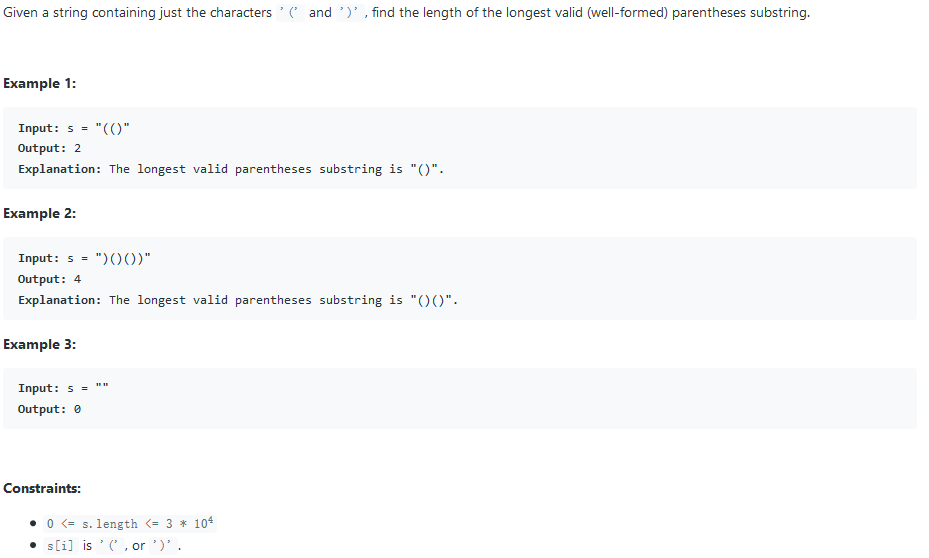

### solution 1: stack

此方法时间性能较优，但消耗空间较多。

此题不能直接压栈来获取最长长度，其不能处理`()(()`的情况。

我们仍然借用栈来进行匹配，匹配上的一对括号做好标记，找字符串中的最长合法标记即可。

每次遇到标记`U`，便意味着有合法匹配；长度+2，当遇到标记`D`，不做操作；当遇到未标记括号，说明当前匹配已结束，结算当前长度。

```c++
int longestValidParentheses(string s) {
	stack<string::iterator> record;
	for (string::iterator it = s.begin(); it != s.end(); it++) {
		if (*it == '(') {
			record.push(it);		//We can push int i instead, considering the index is continuous or not
		}
		else {
			if (record.empty()) continue;
			*record.top() = 'U';
			record.pop();
			*it = 'D';
		}
	}
	int max = 0, count = 0;
	for (int i = 0; i < s.size(); i++) {
		if (s[i] == 'U') {
			count += 2;
		}
		else if (s[i] != 'D') {
			max = max > count ? max : count;
			count = 0;
		}
	}
	return max > count ? max : count;
}
```

### solution 2: DP

时间性能和solution 1 差不多，但空间消耗大幅提升

My solution uses DP. The main idea is as follows: I construct a array longest[], for any longest[i], it stores the longest length of valid parentheses which is end at i.

And the DP idea is :

If s[i] is '(', set longest[i] to 0,because any string end with '(' cannot be a valid one.

Else if s[i] is ')'

​	If s[i-1] is '(', longest[i] = longest[i-2] + 2

​	Else if s[i-1] is ')' and s[i-longest[i-1]-1] == '(', longest[i] = longest[i-1] + 2 + longest[i-longest[i-1]-2] **s[i-longest[i-1]-1] -- s[i-1]是已匹配好的括号段**

For example, input "()(())", at i = 5, longest array is [0,2,0,0,2,0], longest[5] = longest[4] + 2 + longest[1] = 6.

```c++
 int longestValidParentheses(string s) {
            if(s.length() <= 1) return 0;
            int curMax = 0;
            vector<int> longest(s.size(),0);
            for(int i=1; i < s.length(); i++){
                if(s[i] == ')'){
                    if(s[i-1] == '('){
                        longest[i] = (i-2) >= 0 ? (longest[i-2] + 2) : 2;
                        curMax = max(longest[i],curMax);
                    }
                    else{ // if s[i-1] == ')', combine the previous length.
                        if(i-longest[i-1]-1 >= 0 && s[i-longest[i-1]-1] == '('){
                            longest[i] = longest[i-1] + 2 + ((i-longest[i-1]-2 >= 0)?longest[i-longest[i-1]-2]:0);
                            curMax = max(longest[i],curMax);
                        }
                    }
                }
                //else if s[i] == '(', skip it, because longest[i] must be 0
            }
            return curMax;
        }
```

### solution 3: just count

上文提到solution 1 无法解决`()(()`情况，我们可以仅仅再添加一次从后向前遍历来解决，因为未闭合的括号只会出现在一边。

```c++
int longestValidParentheses(string s) {
        int open = 0;
        int close = 0;
        int maxSize = 0;
        for(int i = 0; i < s.size(); i++){
            if(s[i] == '(')
                open++;
            else
                close++;
            
            if(open == close){
                maxSize = std::max(maxSize,open+close);
            }
            else if(close > open){
                open = 0;
                close = 0;
            }
        }
        
        open = 0;
        close = 0;
        
        for(int i = s.size()-1; i >= 0; i--){
            if(s[i] == '(')
                open++;
            else
                close++;
            
            if(open == close){
                maxSize = std::max(maxSize,open+close);
            }
            else if(open > close){
                open = 0;
                close = 0;
            }
        }
        
        return maxSize;
    }
```

## 33. Search in Rotated Sorted Array

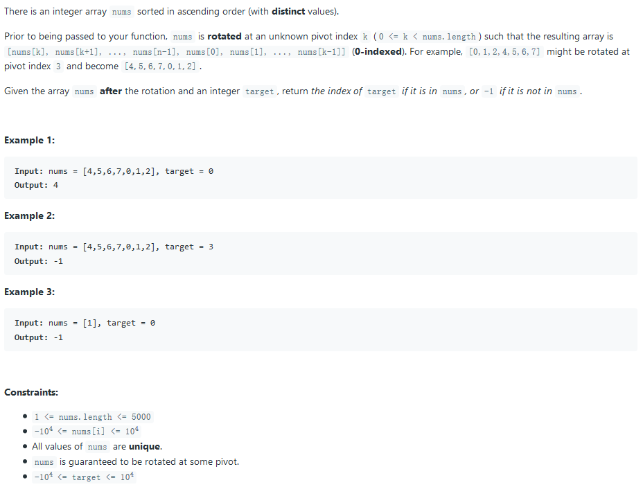

### solution 1: 直接二分查找

由于有中央断点，所以得分`target`在前坡还是后坡上。当`nums[start]>target`时，在后坡上。

```c++
nt find_num(vector<int>& nums, int target) {
	int i = 0;
	while (i < nums.size()) {
		if (nums[i] == target) return i;
        i++;
	}
	return -1;
}
    int search(vector<int>& nums, int target) {
    int start = 0, bound = nums.size() - 1, mid, tag;
	if (nums.size() < 4) return find_num(nums, target);
	if (nums[start] > target) {
		swap(start, bound);
		tag = nums[start];
		while (bound < start) {
			mid = (bound + start) / 2;
			while (nums[mid] > tag) {
				bound = mid + 1;
				mid = (bound + start) / 2;
			}
			if (nums[mid] < target) {
				bound = mid + 1;				//二分法向下取整，不能向上直至相等	case	[4,5,6,7,0,1,2] 3					
			}
			else if (nums[mid] > target) {
				start = mid;
			}
			else return mid;
		}
	}
	else {
		tag = nums[start];
		while (start < bound && nums[start] >= tag) {
			mid = (start + bound) / 2;
			while (nums[mid] < tag) {
				bound = mid;
				mid = (bound + start) / 2;
			}
			if (nums[mid] < target) {
				start = mid + 1;
			}
			else if (nums[mid] > target) {
				bound = mid;
			}
			else return mid;
		}
	}
	return nums[bound] == target ? bound : -1;
    }
```

### solution 2: 找出分界点

先二分查找找到最小的数，该数便是旋转点；然后再用取余法转换为一个常规的二分查找。

`lo+hi`获取的是原坐标系下的终点（因为lo少加了，hi多加了相抵消），所以将中点坐标前移旋转点坐标个位置即可。

```c++
int search(int A[], int n, int target) {
        int lo=0,hi=n-1;
        // find the index of the smallest value using binary search.
        // Loop will terminate since mid < hi, and lo or hi will shrink by at least 1.
        // Proof by contradiction that mid < hi: if mid==hi, then lo==hi and loop would have been terminated.
        while(lo<hi){
            int mid=(lo+hi)/2;
            if(A[mid]>A[hi]) lo=mid+1;
            else hi=mid;
        }
        // lo==hi is the index of the smallest value and also the number of places rotated.
        int rot=lo;
        lo=0;hi=n-1;
        // The usual binary search and accounting for rotation.
        while(lo<=hi){
            int mid=(lo+hi)/2;
            int realmid=(mid+rot)%n;
            if(A[realmid]==target)return realmid;
            if(A[realmid]<target)lo=mid+1;
            else hi=mid-1;
        }
        return -1;
    }
```

## 34. Find First and Last Position of Element in Sorted Array

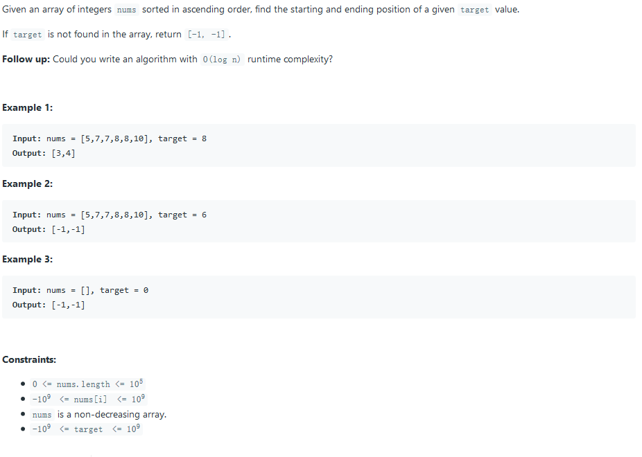

### solution 1:

两次二分查找即可解决，只在更新规则上有细微变化。

```c++
vector<int> searchRange(vector<int>& nums, int target) {
    int i = 0, j = nums.size() - 1;
    vector<int> ret(2, -1);
    if (nums.empty()) return ret;
    // Search for the left one
    while (i < j)
    {
        int mid = (i + j) / 2;
        if (nums[mid] < target) i = mid + 1;
        else j = mid;
    }
    if (nums[i] != target) return ret;
    else ret[0] = i;

    // Search for the right one
    j = nums.size() - 1;  // We don't have to set i to 0 the second time.
    while (i < j)
    {
        int mid = (i + j) / 2 + 1;	// Make mid biased to the right
        if (nums[mid] > target) j = mid - 1;
        else i = mid;				// So that this won't make the search range stuck.
    }
    ret[1] = j;
    return ret;
}
```

## 35. Search Insert Position

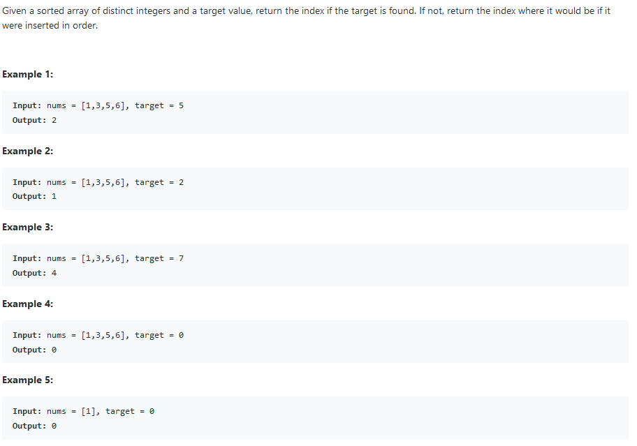

### solution 1:

二分查找解法，最重要的是处理`[1,3,5,6] 7 expecte 4`的情况

在左开右闭的区间内进行查找。

```c++
int searchInsert(vector<int>& nums, int target) {
	int left = 0, right = nums.size();
	nums.push_back(INT_MAX);
	while (left < right) {
		int mid = (left + right) / 2;
		if (nums[mid] < target) left = mid + 1;
		else if (nums[mid] > target) right = mid;
		else return mid;
	}
	return right;
}
```

### solution 2:

二分查找，在闭区间内查找，但在更新时`low = mid + 1`以处理`[1,3,5,6] 7 expecte 4`的情况。

```c++
int searchInsert(vector<int>& nums, int target) {
        int low = 0, high = nums.size()-1;

        // Invariant: the desired index is between [low, high+1]
        while (low <= high) {
            int mid = low + (high-low)/2;

            if (nums[mid] < target)
                low = mid+1;
            else
                high = mid-1;
        }

        // (1) At this point, low > high. That is, low >= high+1
        // (2) From the invariant, we know that the index is between [low, high+1], so low <= high+1. Follwing from (1), now we know low == high+1.
        // (3) Following from (2), the index is between [low, high+1] = [low, low], which means that low is the desired index
        //     Therefore, we return low as the answer. You can also return high+1 as the result, since low == high+1
        return low;
    }
```

## 36. Valid Sudoku

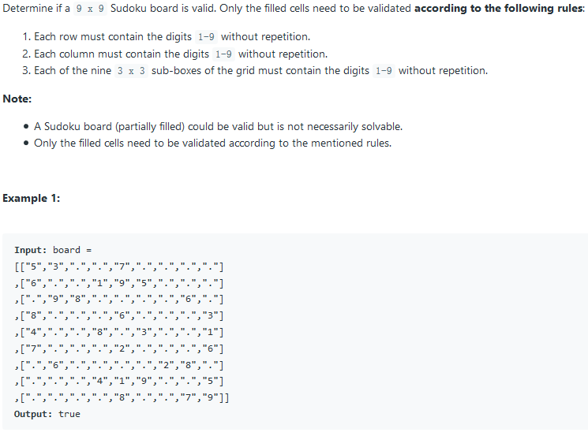

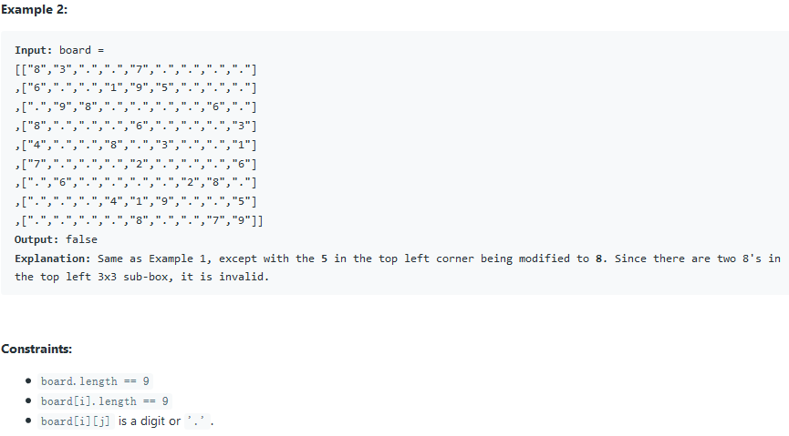

### solution 1:

事后显然的解法，储存每行每列每块的数据，出现重复便返回`false`

```c++
bool isValidSudoku(vector<vector<char>>& board) {
    int rows[9][9] = { 0 };
    int cols[9][9] = { 0 };
    int blocks[3][3][9] = { 0 };

    for (int r = 0; r < 9; r++)
    {
        for (int c = 0; c < 9; c++)
        {
            if (board[r][c] == '.')continue;
            int num = board[r][c] - '1';
            if (cols[num][c]++ || rows[r][num]++ || blocks[r / 3][c / 3][num]++)
                return false;
        }
    }
    return true;
}
```

## 37. Sudoku Solver

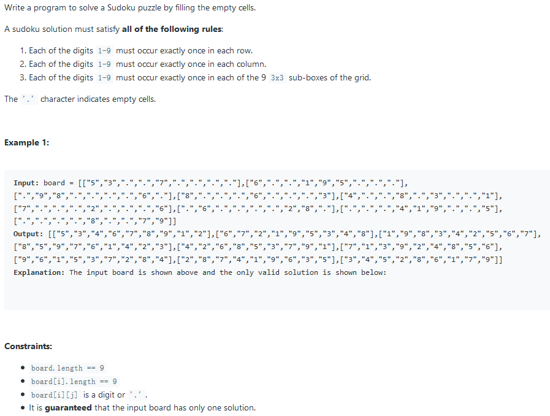

### solution 1:

动态传播网络，系统较为复杂，需要时常回顾。

```c++
class Solution {
	struct cell // encapsulates a single cell on a Sudoku board
	{
		cell() : value(0), numPossibilities(9), constraints() {};

		uint8_t value; // cell value 1..9 or 0 if unset
		// number of possible (unconstrained) values for the cell
		uint8_t numPossibilities;
		// if bitset[v] is 1 then value can't be v
		bitset<10> constraints;
		
	};
	array<array<cell, 9>, 9> cells;

	// sets the value of the cell to [v]
	// the function also propagates constraints to other cells and deduce new values where possible
	bool set(int i, int j, int v)
	{
		// updating state of the cell
		cell& c = cells[i][j];
		if (c.value == v)
			return true;
		if (c.constraints[v])
			return false;
		c.constraints = bitset<10>(0x3FE); // all 1s
		c.constraints.reset(v);
		c.numPossibilities = 1;
		c.value = v;

		// propagating constraints
		for (int k = 0; k < 9; k++) {
			// to the row: 
			if (i != k && !updateConstraints(k, j, v))
				return false;
			// to the column:
			if (j != k && !updateConstraints(i, k, v))
				return false;
			// to the 3x3 square:
			int ix = (i / 3) * 3 + k / 3;
			int jx = (j / 3) * 3 + k % 3;
			if (ix != i && jx != j && !updateConstraints(ix, jx, v))
				return false;
		}
		return true;
	}
	// update constraints of the cell i,j by excluding possibility of 'excludedValue'
	// once there's one possibility left the function recurses back into set()
	bool updateConstraints(int i, int j, int excludedValue)
	{
		cell& c = cells[i][j];
		if (c.constraints[excludedValue]) {
			return true;
		}
		if (c.value == excludedValue) {
			return false;
		}
		c.constraints.set(excludedValue);
		if (--c.numPossibilities > 1)
			return true;
		for (int v = 1; v <= 9; v++) {
			if (!c.constraints[v]) {
				return set(i, j, v);
			}
		}
		assert(false);
	}

	// backtracking state - list of empty cells
	vector<pair<int, int>> bt;

	// find values for empty cells
	bool findValuesForEmptyCells()
	{
		// collecting all empty cells
		bt.clear();
		for (int i = 0; i < 9; i++) {
			for (int j = 0; j < 9; j++) {
				if (!cells[i][j].value)
					bt.push_back(make_pair(i, j));
			}
		}
		// making backtracking efficient by pre-sorting empty cells by numPossibilities
		sort(bt.begin(), bt.end(), [this](const pair<int, int>& a, const pair<int, int>& b) {
			return cells[a.first][a.second].numPossibilities < cells[b.first][b.second].numPossibilities; });
		return backtrack(0);
	}

	// Finds value for all empty cells with index >=k
	bool backtrack(int k)
	{
		if (k >= bt.size())
			return true;
		int i = bt[k].first;
		int j = bt[k].second;
		// fast path - only 1 possibility
		if (cells[i][j].value)
			return backtrack(k + 1);
		auto constraints = cells[i][j].constraints;
		// slow path >1 possibility.
		// making snapshot of the state
		array<array<cell, 9>, 9> snapshot(cells);
		for (int v = 1; v <= 9; v++) {
			if (!constraints[v]) {
				if (set(i, j, v)) {
					if (backtrack(k + 1))
						return true;
				}
				// restoring from snapshot,
				// note: computationally this is cheaper
				// than alternative implementation with undoing the changes
				cells = snapshot;
			}
		}
		return false;
	}
public:
	void solveSudoku(vector<vector<char>>& board) {
		cells = array<array<cell, 9>, 9>(); // clear array
		// Decoding input board into the internal cell matrix.
		// As we do it - constraints are propagated and even additional values are set as we go
		// (in the case if it is possible to unambiguously deduce them).
		for (int i = 0; i < 9; i++)
		{
			for (int j = 0; j < 9; j++) {
				if (board[i][j] != '.' && !set(i, j, board[i][j] - '0'))
					return; // sudoku is either incorrect or unsolvable
			}
		}
		// if we're lucky we've already got a solution,
		// however, if we have empty cells we need to use backtracking to fill them
		if (!findValuesForEmptyCells())
			return; // sudoku is unsolvable

		// copying the solution back to the board
		for (int i = 0; i < 9; i++)
		{
			for (int j = 0; j < 9; j++) {
				if (cells[i][j].value)
					board[i][j] = cells[i][j].value + '0';
			}
		}
	}
};
```

## 38. Count and Say

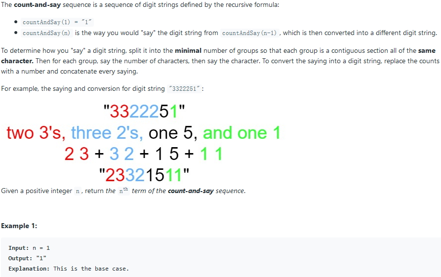

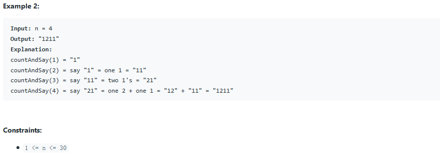

### solution 1: recursion

通过递归来求解。

```c++
string countAndSay(int n) {
	if (n == 1) return "1";
	string former = countAndSay(n - 1);
	former.push_back('$');
	string result;
	int count = 0;
	char temp = former[0];
	for (int i = 0; i < former.size(); i++) {
		if (former[i] != temp) {
			result.push_back(count + '0');
			result.push_back(temp);
			count = 0;
			temp = former[i];
		}
		count++;
	}
	return result;
}
```

## 39. Combination Sum

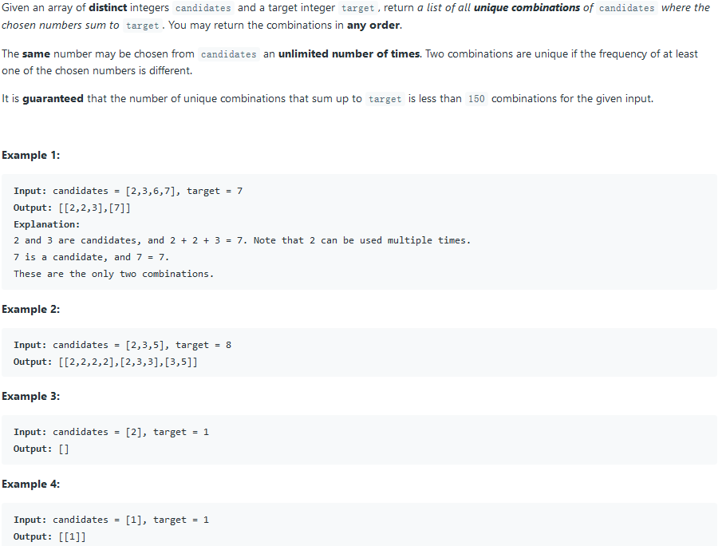

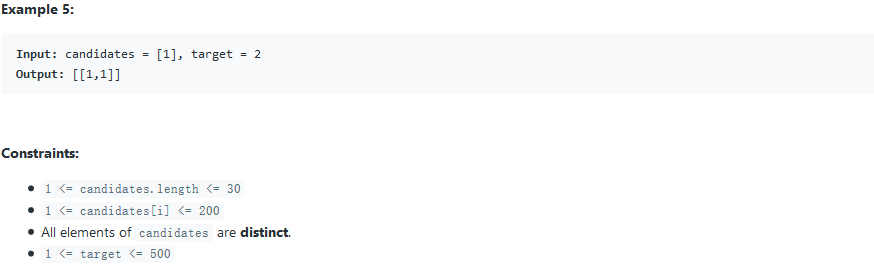

### solution 1: backtrack

`push_back`和`pop_back`的操作在`backtrack`中非常重要

```c++
vector<vector<int>> combinationSum(vector<int>& candidates, int target) {
	vector<vector<int>> result;
	backtrack(result, candidates, target);
	return result;
}

void backtrack(vector<vector<int>>& result, vector<int>& candidates, int target, int sum = 0, int i = 0) {
	static vector<int> temp;
	if (sum > target) return;
	if (sum == target) result.push_back(temp);
	while (i < candidates.size()) {
		temp.push_back(candidates[i]);
		backtrack(result, candidates, target, sum + candidates[i], i);
		temp.pop_back();
		i++;
	}
}
```

## 40. Combination Sum II

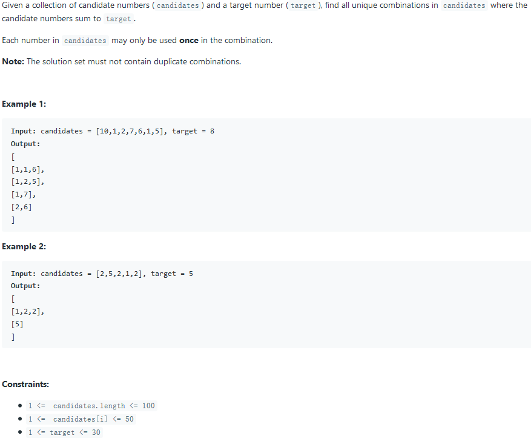

### solution 1: backtrack

同样是递归，只是需要避免重复即可。

```c++
void backtrack(vector<vector<int>>& result, vector<int>& candidates, int index, int res) {
	static vector<int> temp;
	if (res == 0) {
		result.push_back(temp);
		return;
	}
	if (index == candidates.size() || res < candidates[index]) return;
	
	temp.push_back(candidates[index++]);
	backtrack(result, candidates, index, res - candidates[index - 1]);
	temp.pop_back();
	while (index != candidates.size() && candidates[index - 1] == candidates[index]) index++;
	backtrack(result, candidates, index, res);
}


vector<vector<int>> combinationSum2(vector<int>& candidates, int target) {
	vector<vector<int>> result;
	sort(candidates.begin(), candidates.end());
	backtrack(result, candidates, 0, target);
	return result;
}
```

