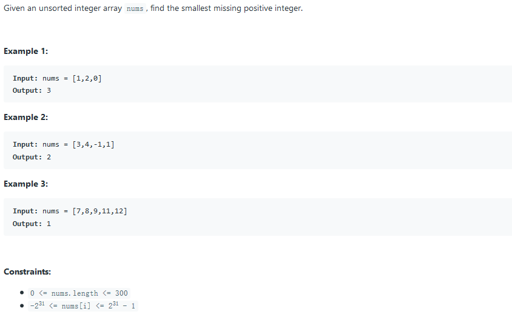
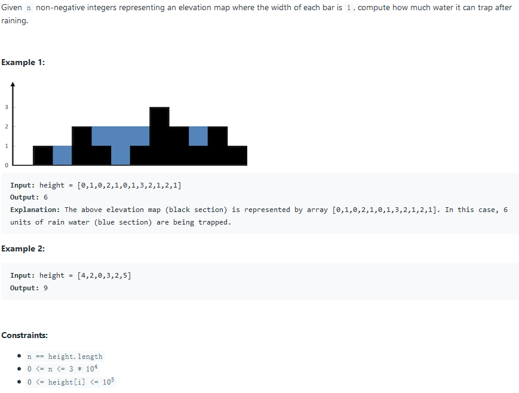
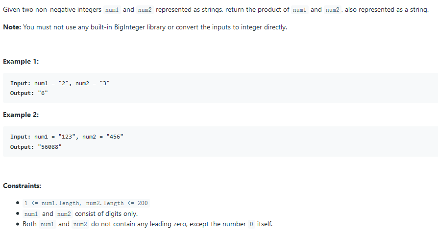
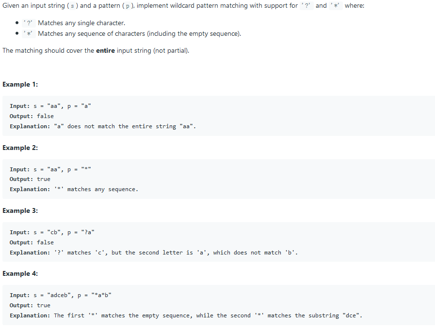
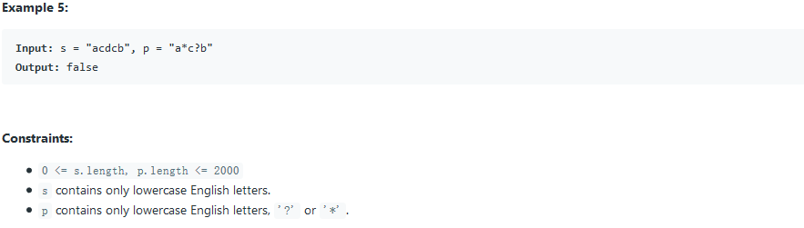
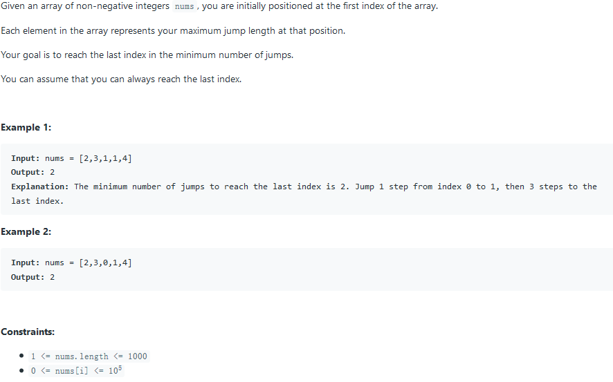
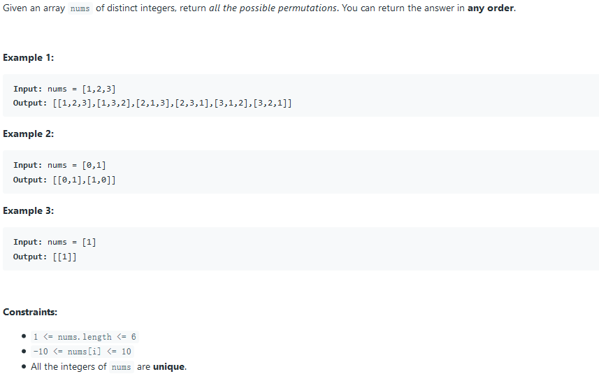
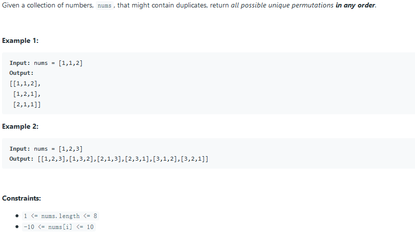

## 41. First Missing Positive



### solution 1:

把小于等于`len`的数放在`i-1`处，最后从头开始，找到第一个不是`i-1`的数，该数即为所求。

```c++
int firstMissingPositive(vector<int>& nums) {
	int n = nums.size();
	for (int i = 0; i < n; i++)
		while (nums[i] > 0 && nums[i] <= n && nums[nums[i] - 1] != nums[i])
			swap(nums[i], nums[nums[i] - 1]);
	for (int i = 0; i < n; i++)
		if (nums[i] != i + 1)
			return i + 1;
	return n + 1;
}
```

## 42. Trapping Rain Water



### solution 1: find max

先找到最大值，然后算出最大可用面积`max * height.size()`，然后再从左和从右依次向`max`寻求，对每一个点计算多算的面积。

```c++
int trap(vector<int>& height) {
	if (height.size() == 0) return 0;
	int pos = 0, max = 0;
	for (size_t i = 0; i < height.size(); i++) {
		if (height[i] > max) {
			max = height[i];
			pos = i;
		}
	}
	int water = max * height.size();
	for (int left = 0, current_max = 0, max_pos = 0; left <= pos; left++) {
		if (height[left] > current_max) {
			current_max = height[left];
			max_pos = left;
		}
		water -= (height[left] + (max - current_max));
	}
	for (int right = height.size() - 1, current_max = 0, max_pos = 0; right > pos; right--) {
		if (height[right] > current_max) {
			current_max = height[right];
			max_pos = right;
		}
		water -= (height[right] + (max - current_max));
	}
	return water;
}
```

### solution 2: iteration from left and right

从左和右向中间迭代，每次移动较矮的那一边的柱子，这样能够保证一定是在包含在`left`和`right`之内的可用水柱。

```c++
int trap(int A[], int n) {
	int left = 0; int right = n - 1;
	int res = 0;
	int maxleft = 0, maxright = 0;
	while (left <= right) {
		if (A[left] <= A[right]) {
			if (A[left] >= maxleft) maxleft = A[left];
			else res += maxleft - A[left];
			left++;
		}
		else {
			if (A[right] >= maxright) maxright = A[right];
			else res += maxright - A[right];
			right--;
		}
	}
	return res;
}
```

## 43. Multiply Strings



### solution 1:

正常思路逐位相乘即可。

```c++
string multiply(string num1, string num2) {
    unsigned int l1 = num1.size(), l2 = num2.size();
    if (l1 == 0 || l2 == 0 || num1 == "0" || num2 == "0") return "0";

    vector<int> v(l1 + l2, 0);

    for (unsigned int i = 0; i < l1; i++) {
        int carry = 0;
        int n1 = (int)(num1[l1 - i - 1] - '0');//Calculate from rightmost to left
        for (unsigned int j = 0; j < l2; j++) {
            int n2 = (num2[l2 - j - 1] - '0');//Calculate from rightmost to left

            int sum = n1 * n2 + v[i + j] + carry;
            carry = sum / 10;
            v[i + j] = sum % 10;
        }
        if (carry > 0)
            v[i + l2] += carry;

    }
    int start = l1 + l2 - 1;
    while (v[start] == 0) start--;
    if (start == -1) return "0";

    string s = "";
    for (int i = start; i >= 0; i--)
        s += (char)(v[i] + '0');
    return s;
}
```

## 44. Wildcard Matching





### solution 1: 2D-dp

```c++
bool isMatch(string s, string p) {
	string::size_type m = s.size(), n = p.size();
	vector<vector<bool>> result(m + 1, vector<bool>(n + 1, false));
	result[0][0] = true;
	for (size_t i = 1; i <= n; i++) {
		result[0][i] = p[i - 1] == '*' && result[0][i - 1];
	}
	for (size_t i = 1; i <= m; i++) {
		for (size_t j = 1; j <= n; j++) {
			if (p[j - 1] != '*') {
				result[i][j] = result[i - 1][j - 1] && (s[i - 1] == p[j - 1] || p[j - 1] == '?');
			}
			else {
				result[i][j] = result[i][j - 1] || result[i - 1][j - 1] || result[i - 1][j];
			}
		}
	}
	return result[m][n];
}
```

### solution 2: 1D optimize dp

```java
public boolean isMatch(String s, String p) {
        boolean[] dp = new boolean[p.length() + 1];
        dp[0] = true;
        for (int i = 1; i <= p.length(); i++) {
            dp[i] = p.charAt(i - 1) == '*' && dp[i - 1];
        }
        for (int i = 1; i <= s.length(); i++) {
            boolean prev = dp[0], cur = false;
            dp[0] = false;
            for (int j = 1; j <= p.length(); j++) {
                cur = dp[j];
                if (p.charAt(j - 1) != '*') {
                    dp[j] = prev && (s.charAt(i - 1) == p.charAt(j - 1) || p.charAt(j - 1) == '?');
                } else {
                    dp[j] = cur || prev || dp[j - 1];
                }
                prev = cur;
            }
        }
        return dp[p.length()];
    }	
```

### solution 3: iterator

```c
bool isMatch(const char* s, const char* p) {
	const char* star = NULL;
	const char* ss = s;
	while (*s) {
		//advancing both pointers when (both characters match) or ('?' found in pattern)
		//note that *p will not advance beyond its length 
		if ((*p == '?') || (*p == *s)) { s++; p++; continue; }

		// * found in pattern, track index of *, only advancing pattern pointer 
		if (*p == '*') { star = p++; ss = s; continue; }

		//current characters didn't match, last pattern pointer was *, current pattern pointer is not *
		//only advancing pattern pointer
		if (star) { p = star + 1; s = ++ss; continue; }

		//current pattern pointer is not star, last patter pointer was not *
		//characters do not match
		return false;
	}

	//check for remaining characters in pattern
	while (*p == '*') { p++; }

	return !*p;
}
```

## 45. Jump Game II



### solution 1: DP solution

```c++
int jump(vector<int>& nums) {
	int n = nums.size(), step = 0, start = 0, end = 0;
	while (end < n - 1) {
		step++;
		int maxend = end + 1;
		for (int i = start; i <= end; i++) {
			if (i + nums[i] >= n - 1) return step;
			maxend = max(maxend, i + nums[i]);
		}
		start = end + 1;
		end = maxend;
	}
	return step;
}
```

### solution 1: BFS solution

```java
//This problem has a nice BFS structure.Let's illustrate it using the example nums = [2, 3, 1, 1, 4] in the problem statement.
//We are initially at position 0. Then we can move at most nums[0] steps from it. So, after one move, we may reach nums[1] = 3 or nums[2] = 1. 
//So these nodes are reachable in 1 move. From these nodes, we can further move to nums[3] = 1 and nums[4] = 4. Now you can see that the target nums[4] = 4 is reachable in 2 moves.
//
//Putting these into codes, we keep two pointers startand end that record the current range of the starting nodes.
//Each time after we make a move, update start to be end + 1 and end to be the farthest index that can be reached in 1 move from the current[start, end].
//
//To get an accepted solution, it is important to handle all the edge cases.And the following codes handle all of them in a unified way without using the unclean if statements :-)
public int jump(int[] nums) {
        int last = nums.length - 1, step = 0, start = 0, end = 0;
        while (end < last) {
            step++;
            int maxEnd = end + 1;
            for (int i = start; i <= end; i++) {
                if (i + nums[i] >= last)
                    return step;
                maxEnd = Math.max(maxEnd, i + nums[i]);
            }
            start = end + 1;
            end = maxEnd;
        }
        return step;
    }
```

## 46. Permutations



### solution 1: DFS solution

```java
public List<List<Integer>> permute(int[] nums) {
        List<List<Integer>> res = new ArrayList<>();
        dfs(nums, 0, res);
        return res;
    }
    
    private void dfs(int[] nums, int index, List<List<Integer>> res) {
        if (index == nums.length) {
            List<Integer> cur = new ArrayList<>();
            for (int i : nums) {
                cur.add(i);
            }
            res.add(cur);
            return;
        }
        
        for (int i = index; i < nums.length; i++) {
            swap(nums, index, i);
            dfs(nums, index + 1, res);
            swap(nums, index, i);
        }
    }
    
    private void swap(int[] nums, int i, int j) {
        int temp = nums[i];
        nums[i] = nums[j];
        nums[j] = temp;
    }
```

## 47. Permutations II



### solution 1:

与`Permutations`类似，只需要能够避免重复即可

```c++
void recursion(vector<int> num, int i, int j, vector<vector<int> > &res) {
        if (i == j-1) {
            res.push_back(num);
            return;
        }
        for (int k = i; k < j; k++) {
            if (i != k && num[i] == num[k]) continue;
            swap(num[i], num[k]);
            recursion(num, i+1, j, res);
        }
    }
    vector<vector<int> > permuteUnique(vector<int> &num) {
        sort(num.begin(), num.end());
        vector<vector<int> >res;
        recursion(num, 0, num.size(), res);
        return res;
    }
```

